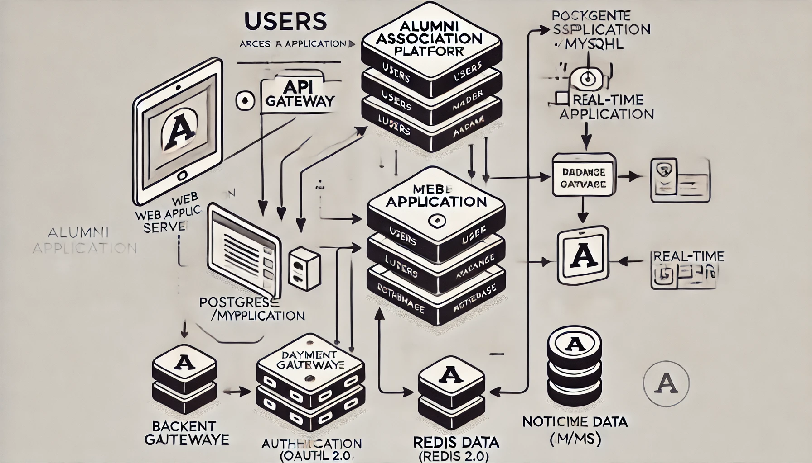

# Smart India Hackathon Workshop
# Date: 30.12.2024
## Register Number: 24900596
## Name: Kishore B
## Problem Title
Comprehensive Alumni Engagement Platform for Educational Institutions
## Problem Description
**Background**:
Alumni associations are a critical component of educational institutions, bridging the gap between alumni and their alma mater. These associations play a vital role in maintaining relationships, fostering professional networking, encouraging philanthropic contributions, and inspiring current students through alumni achievements. However, many institutions struggle to maintain consistent and meaningful engagement with their alumni due to outdated systems, limited resources, and lack of innovative platforms.

**Challenges Faced**:
1. **Fragmented Communication**: Many alumni lose touch with their institutions due to a lack of centralized and easily accessible platforms.
2. **Limited Networking Opportunities**: Alumni struggle to connect with peers, mentors, and job opportunities that align with their interests or career goals.
3. **Inefficient Donation Systems**: Without secure and transparent donation processes, alumni are hesitant to contribute to institutional growth.
4. **Poor Event Management**: Organizing alumni reunions, webinars, or workshops becomes a logistical challenge without an integrated system for announcements, registrations, and feedback.
5. **Lack of Recognition**: Success stories of alumni often go unnoticed, missing the opportunity to inspire current students and instill pride among graduates.
6. **Feedback Channels**: Institutions struggle to gather insights and suggestions from their alumni for continuous improvement.

**Proposed Solution**:
The creation of a robust Alumni Association platform, accessible via both web and mobile applications, will address these challenges. The platform will:

1. Provide easy and secure alumni registration and profile management.
2. Facilitate networking with a directory, job board, and mentorship programs.
3. Enable secure and transparent donation systems to support institutional initiatives.
4. Showcase alumni achievements, promoting recognition and motivation.
5. Manage events effectively with automated tools for planning, registration, and reminders.
6. Incorporate feedback mechanisms for continuous development and engagement strategies.

**Impact**:
By addressing these challenges, the platform will:

1. Strengthen alumni relationships and increase their participation in institutional growth.
2. Enhance career opportunities for alumni through mentorship and job connections.
3. Encourage a culture of giving back to the institution, driving financial support for various initiatives.
4. Build a vibrant and engaged alumni community that contributes to the legacy and future success of the institution. 
## Problem Creater's Organization
Ministry of Education, Government of India

## Idea
Create a dynamic and scalable Alumni Association platform that strengthens the bond between alumni and their alma mater. The platform will serve as a one-stop solution for networking, mentorship, donations, event participation, and showcasing alumni achievements through web and mobile applications.

## Proposed Solution / Architecture Diagram

**Solution**:
1. **User-Friendly Interface**: Accessible web and mobile apps with intuitive design for seamless interaction.
2. **Centralized Backend**: A robust backend to manage user data, events, jobs, and donations securely.
3. **Key Features**: Alumni registration, secure donation portal, job board, networking hub, event management, and success story highlights.
4. **Security**: End-to-end encryption, secure authentication (OAuth 2.0), and GDPR compliance.

**Architecture Diagram**:
1. **Frontend** → Web (React.js) and Mobile (Flutter).
2. **API Gateway** → Handles all requests and routes them to the backend.
3. **Backend** → Built on Django/Node.js with a RESTful API.
4. **Database** → PostgreSQL for structured data and Redis for real-time updates.
5. **Third-Party Integrations** → Payment gateways, notification systems, and cloud hosting.

## Use Cases
1. **Alumni Registration**:
    Simplified sign-up and profile updates for alumni across web and mobile platforms.
2. **Donation Management**:
    Alumni can contribute to initiatives securely with options to track donation history.
3. **Networking Features**:
    Discover alumni based on shared interests, location, or profession.
4. **Job Opportunities**:
    Alumni can post and apply for jobs through a centralized portal.
5. **Event Participation**:
    Alumni register for events, receive reminders, and provide feedback.
6. **:
    Display notable alumni stories to inspire others and enhance institutional pride.

## Technology Stack
1. **Frontend**: React.js for web, Flutter for mobile.
2. **Backend**: Node.js (Express) or Django for server-side logic.
3. **Database**: PostgreSQL/MySQL for data storage; Firebase for real-time data sync.
4. **Hosting**: AWS/GCP with scalable load balancing.
5. **Authentication**: OAuth 2.0 and JWT for secure access.
6. **Payment Gateway**: Razorpay, Stripe, or PayPal.
7. **Notification Services**: Twilio for SMS, SendGrid for email notifications.

## Dependencies
1. **APIs and SDKs**:
   1. Payment gateway APIs for donation handling.
   2. Firebase for real-time communication.
2. **Cloud Services**: AWS or GCP for reliable hosting and scalability.
3. **Libraries**:
   1. Material-UI or Bootstrap for frontend styling.
   2. Socket.io for real-time updates.
4. **Version Control**: GitHub/GitLab for collaborative development.
5. **Third-Party Tools**: Docker for containerization, Postman for API testing.